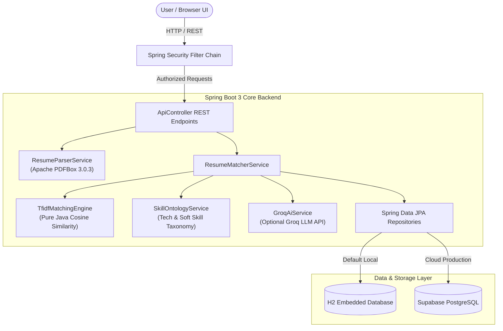

# ✦ SkillMatch — Enterprise Resume Ranker & ATS Engine

[](https://skillmatch-ranker.onrender.com)
[](https://www.oracle.com/java/)
[](https://spring.io/projects/spring-boot)
[](https://supabase.com)
[](LICENSE)

> **SkillMatch** is a high-performance Java Fullstack Application designed to evaluate, rank, and match candidate resumes against job descriptions with mathematical precision. Featuring a **Hybrid Matching Architecture** (sub-10ms Java TF-IDF vector similarity + optional **Groq AI LLM** enhancement), an enterprise **Spring Security** layer, **Spring Data JPA** persistence, and an editorial **Dimension** dusk-lit glassmorphic web UI ([`DESIGN.md`](file:///f:/New%20folder%20%282%29/DESIGN.md)).

---

## 🌐 Live Application Link

* **Hosted Web Application**: [https://skillmatch-ranker.onrender.com](https://skillmatch-ranker.onrender.com) *(Replace with your live URL)*
* **Interactive OpenAPI 3 / Swagger Docs**: [https://skillmatch-ranker.onrender.com/swagger-ui.html](https://skillmatch-ranker.onrender.com/swagger-ui.html)
* **GitHub Repository**: [https://github.com/ghanashya27-creator/SkillMatch](https://github.com/ghanashya27-creator/SkillMatch)

---

## 📌 Table of Contents
1. [Key Features & Highlights](#-key-features--highlights)
2. [Dual Target User Personas](#-dual-target-user-personas)
3. [System Architecture & Design](#-system-architecture--design)
4. [Matching Engine Algorithm](#-matching-engine-algorithm)
5. [Tech Stack](#-tech-stack)
6. [Design Aesthetics & UI Tokens](#-design-aesthetics--ui-tokens)
7. [Security & Robustness](#-security--robustness)
8. [Local Machine Setup](#-local-machine-setup)
9. [Cloud Deployment Guide (Render / Supabase)](#-cloud-deployment-guide-render--supabase)
10. [Author & Contact](#-author--contact)

---

## 🌟 Key Features & Highlights

- 🎯 **Single Resume Candidate Matcher**: Instant evaluation of PDF/Text resumes against target job descriptions with circular animated score gauges, matched skills (green pills), missing skill gaps (red pills), and ATS improvement steps.
- 🏆 **Recruiter Bulk Candidate Leaderboard**: Upload 20+ resumes simultaneously for a job position and generate a ranked leaderboard sorted by overall compatibility percentage.
- 📊 **1-Click CSV Report Exporter**: Download structured candidate ranking reports for recruiter shortlisting.
- ⚡ **Sub-10ms Offline Performance**: Core TF-IDF Cosine Similarity engine runs 100% locally in pure Java with zero external API dependencies or API costs.
- 🤖 **Optional Groq AI LLM Integration**: Plug-and-play AI feedback using Groq's `llama-3.3-70b-versatile` model for personalized resume rewrite recommendations when a `GROQ_API_KEY` is provided.
- 🗄️ **Dual Database Persistence (H2 + Supabase)**: Runs out-of-the-box with zero setup using an in-memory H2 database, while supporting Supabase PostgreSQL cloud persistence.
- 📖 **Interactive OpenAPI 3 / Swagger Documentation**: Full REST API specification at `/swagger-ui.html`.

---

## 👥 Dual Target User Personas

| Target Persona | Key Pain Point | How SkillMatch Solves It |
| :--- | :--- | :--- |
| **Recruiters & HR Managers** | Manual screening of 200+ resumes per job role takes 15+ hours weekly. | **Recruiter Mode**: Bulk upload resumes, view instant ranked leaderboard badges, filter candidate shortlists, and export CSV reports. |
| **Job Seekers & Applicants** | Resumes get rejected by ATS filters without feedback on keyword gaps. | **Candidate Mode**: Upload resume PDF/TXT, get ATS compatibility score %, view missing keywords, and follow actionable rewrite advice. |
| **Placement Agencies & Consultants** | Need objective scoring metrics to present candidate shortlists to client companies. | **Match History Analytics**: Database persistence of match evaluations and score breakdowns over time. |

---

## 🏗️ System Architecture & Design



---

## 🧮 Matching Engine Algorithm

SkillMatch calculates a weighted **Multi-Factor Score** derived from four core dimensions:

$$\text{Overall Fit Score} = (S_{\text{skill}} \times 0.40) + (S_{\text{semantic}} \times 0.35) + (S_{\text{experience}} \times 0.15) + (S_{\text{education}} \times 0.10)$$

1. **Skill Match Score ($S_{\text{skill}}$ — 40%)**: Ratio of matched hard & soft technical skills against job requirements.
2. **Semantic Similarity ($S_{\text{semantic}}$ — 35%)**: TF-IDF Term Frequency-Inverse Document Frequency vector space distance using Cosine Similarity:
   $$\text{Cosine Similarity} = \frac{\mathbf{A} \cdot \mathbf{B}}{\|\mathbf{A}\| \|\mathbf{B}\|}$$
3. **Experience Fit Score ($S_{\text{experience}}$ — 15%)**: Parsed years of experience vs required minimum.
4. **Education Score ($S_{\text{education}}$ — 10%)**: Degree qualification vector matching.

### Compatibility Tiers:
* 🟢 **Top Match (85% - 100%)**: Exceptional qualification alignment.
* 🔵 **Strong Match (70% - 84%)**: Meets key requirements; minor keyword gaps.
* 🟡 **Moderate Match (50% - 69%)**: Partial match; requires targeted skill additions.
* 🔴 **Low Match (<50%)**: Low alignment with core job specifications.

---

## 🛠️ Tech Stack

### Backend
* **Java**: Java 17+ (Java 24 Compatible)
* **Framework**: Spring Boot 3.3.4 (Spring Web, Spring Security, Spring Data JPA, DevTools)
* **Document Parsing**: Apache PDFBox 3.0.3
* **API Documentation**: Springdoc OpenAPI 3 (Swagger UI)
* **Build System**: Apache Maven 3.9.9

### Frontend
* **Core**: HTML5, CSS3, ES6+ Vanilla JavaScript (Single Page Architecture)
* **Design Tokens**: `DESIGN.md` Dimension dusk-lit design system
* **Visual Highlights**: Animated SVG score progress gauges, frosted glass backdrop filters, 9999px pill controls.

### Persistence & Storage
* **Local Database**: Embedded H2 Database (In-memory, zero-config default)
* **Production Database**: PostgreSQL (Supabase Cloud ready)

### AI / NLP
* **Primary Engine**: Pure Java TF-IDF Vector Space Model
* **Optional LLM**: Groq API (`llama-3.3-70b-versatile`)

---

## 🎨 Design Aesthetics & UI Tokens (`DESIGN.md`)

The user interface follows the **Dimension** dusk-lit workspace reference:
* **Void Canvas Base**: `#0a0a0a` matte-black canvas
* **Graphite Panels**: `#161616` elevated card surfaces
* **Frosted Glass**: Translucent panels with 8% opacity and 8px backdrop blur
* **Pill Silhouette**: `9999px` border-radius for primary white buttons (`#ffffff` bg, `#000000` text)
* **Dusk Violet Glow**: `#6b62f2` radial spotlight wash
* **Typography**: `DM Sans` (display/body) and `Geist` (feature headings)

---

## 🛡️ Security & Robustness

- **File Upload Protection**: Magic-byte PDF/text verification, extension sanitization, and 15MB file upload limiters.
- **Spring Security Controls**: Frame-Options restriction (H2 console safe), XSS headers, Content Security Policy (CSP), and CORS filters.
- **Exception Masking**: Global `@ControllerAdvice` mapping errors to clean JSON responses without exposing raw stack traces.
- **Crash-Proof Parsing**: Defensive regex handling for missing or malformed candidate resume data.

---

## 💻 Local Machine Setup

### Prerequisites
* **Java Development Kit (JDK 17 or higher)** installed.
* No local Maven installation required (includes Maven Wrapper `mvnw.cmd`).

### Quick Start Instructions

1. **Clone the Repository**:
   ```bash
   git clone https.github.com/ghanashya27-creator/SkillMatch.git
   cd SkillMatch
   ```

2. **Run the Application**:
   * **Windows (Command Prompt / PowerShell)**:
     ```cmd
     .\mvnw.cmd spring-boot:run
     ```
     *or double-click [`run.bat`](file:///f:/New%20folder%20%282%29/run.bat).*
   * **Linux / macOS**:
     ```bash
     chmod +x mvnw
     ./mvnw spring-boot:run
     ```

3. **Access the Local Endpoints**:
   * 🌐 **Web Application**: [http://localhost:8080](http://localhost:8080)
   * 📖 **Swagger API Docs**: [http://localhost:8080/swagger-ui.html](http://localhost:8080/swagger-ui.html)
   * 🗄️ **H2 Database Console**: [http://localhost:8080/h2-console](http://localhost:8080/h2-console)

---

## ☁️ Cloud Deployment Guide (Render / Supabase)

### Deploying to Render.com (Free Web Service)

1. Push code to your GitHub repository `https://github.com/ghanashya27-creator/SkillMatch.git`.
2. Log in to [Render.com](https://render.com) and click **New > Web Service**.
3. Connect your GitHub repository.
4. Set the build and start configuration:
   * **Environment**: `Java`
   * **Build Command**: `./mvnw clean package -DskipTests`
   * **Start Command**: `java -jar target/skillmatch-resume-ranker-1.0.0.jar`
5. (Optional) Add environment variables for **Supabase PostgreSQL**:
   * `SPRING_DATASOURCE_URL`: `jdbc:postgresql://db.<your-supabase-id>.supabase.co:5432/postgres`
   * `SPRING_DATASOURCE_USERNAME`: `postgres`
   * `SPRING_DATASOURCE_PASSWORD`: `<your-supabase-password>`
   * `GROQ_API_KEY`: `<your-optional-groq-key>`
6. Click **Deploy**. Your app will be live at `https://<your-app-name>.onrender.com`.

---

## 👤 Author & Contact

**Ghanashyam**
* **GitHub**: [@ghanashya27-creator](https://github.com/ghanashya27-creator)
* **Repository**: [github.com/ghanashya27-creator/SkillMatch](https://github.com/ghanashya27-creator/SkillMatch)
* **Email**: ghanashya27@gmail.com

---

*Made with ♥ by Ghanashyam — Powered by Java, Spring Boot 3, and Modern Web UI.*
